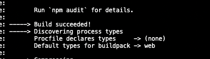
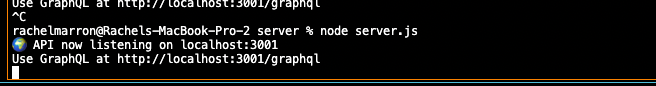

## MERN - Book Search Engine 

## Link to Deployed Assets
https://fathomless-spire-41649.herokuapp.com/

New Repo:
https://github.com/racheldmarron/book-search-engineer-v2

Original Repo: 
https://github.com/racheldmarron/book-search-engineer 

## NOTE TO GRADERS:
I have spent countless hours on this assignment. I have worked with 2 tutors, both of whom told me my code was completely correct and they do not understand why it won't correctly deploy to Heroku or connect to graphQL. 

When I run on the server, I get a successful message and when I deploy to Heroku, I get a successful message. I am attaching screenshots below for reference. 

Please view both repository links I provided to see where all of my commits are. I had to create this new repo at the last minute because something was going on with the overall git folder not pulling in all files. 

I understand if you need to give me a bad grade, but please do not fail me or mark the assignment as incomplete because I have done everything I can and both the tutors I spoke with could provide no explanation as to what was going on. Thanks. 

## Visual Representations
## Images 





## Overview 
The goal of this project was to regactor a Google Books API search engine from RESTful API to GraphQL API built with Apollo Server. This application uses MERN stack with a React front end, MongoDB database, and Node/Express.js server. 

## User Story
```md
AS AN avid reader
I WANT to search for new books to read
SO THAT I can keep a list of books to purchase
```

## Acceptance Criteria
```md
GIVEN a book search engine
WHEN I load the search engine
THEN I am presented with a menu with the options Search for Books and Login/Signup and an input field to search for books and a submit button
WHEN I click on the Search for Books menu option
THEN I am presented with an input field to search for books and a submit button
WHEN I am not logged in and enter a search term in the input field and click the submit button
THEN I am presented with several search results, each featuring a book’s title, author, description, image, and a link to that book on the Google Books site
WHEN I click on the Login/Signup menu option
THEN a modal appears on the screen with a toggle between the option to log in or sign up
WHEN the toggle is set to Signup
THEN I am presented with three inputs for a username, an email address, and a password, and a signup button
WHEN the toggle is set to Login
THEN I am presented with two inputs for an email address and a password and login button
WHEN I enter a valid email address and create a password and click on the signup button
THEN my user account is created and I am logged in to the site
WHEN I enter my account’s email address and password and click on the login button
THEN I the modal closes and I am logged in to the site
WHEN I am logged in to the site
THEN the menu options change to Search for Books, an option to see my saved books, and Logout
WHEN I am logged in and enter a search term in the input field and click the submit button
THEN I am presented with several search results, each featuring a book’s title, author, description, image, and a link to that book on the Google Books site and a button to save a book to my account
WHEN I click on the Save button on a book
THEN that book’s information is saved to my account
WHEN I click on the option to see my saved books
THEN I am presented with all of the books I have saved to my account, each featuring the book’s title, author, description, image, and a link to that book on the Google Books site and a button to remove a book from my account
WHEN I click on the Remove button on a book
THEN that book is deleted from my saved books list
WHEN I click on the Logout button
THEN I am logged out of the site and presented with a menu with the options Search for Books and Login/Signup and an input field to search for books and a submit button  
```

## Installation
This application can be run using the deployed Heroku link. To run on your computer locally, follow these steps below:
<ul>
<li>Clone this repository to your computer</li>
<li>Run "npm install" in the command line of your terminal</li>
<li>Run "npm start" to start the application's backend</li>
<li>Go to http//:localhost:3001 to use locally, or http://localhost:3001/graphql to use GraphQL</li>
</ul>

## Contributors

- Thank you to my tutor Katherine Redford & Jordan Hessler for helping me work through errors with Heroku deployment and connecting Atlas databse. 

## License

This application is covered under MIT License    

[](https://opensource.org/licenses/MIT)

- - -
© 2022 Rachel Delaney Marron, Inc. All Rights Reserved.